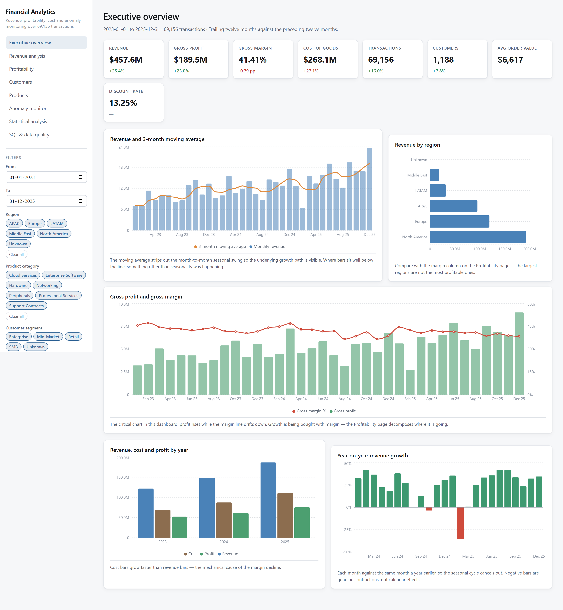
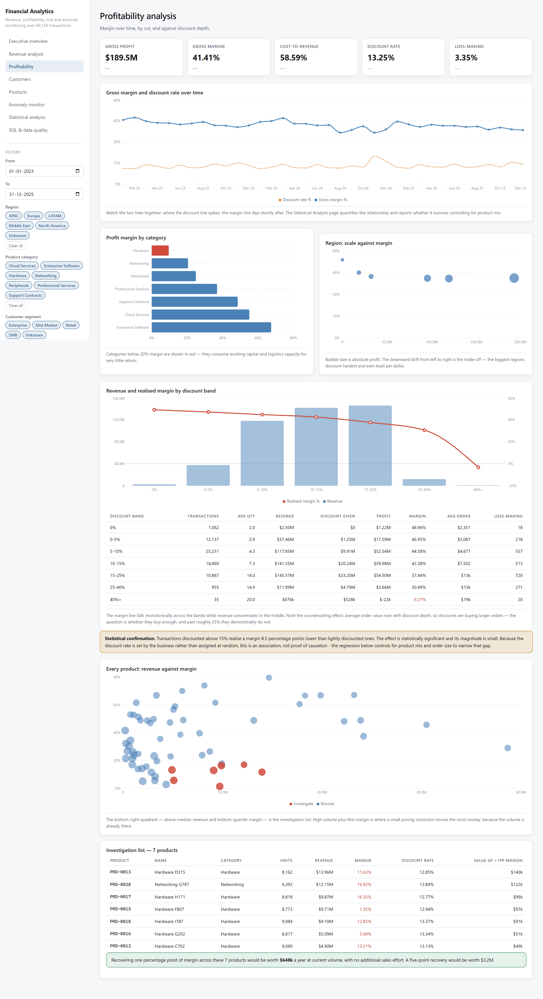
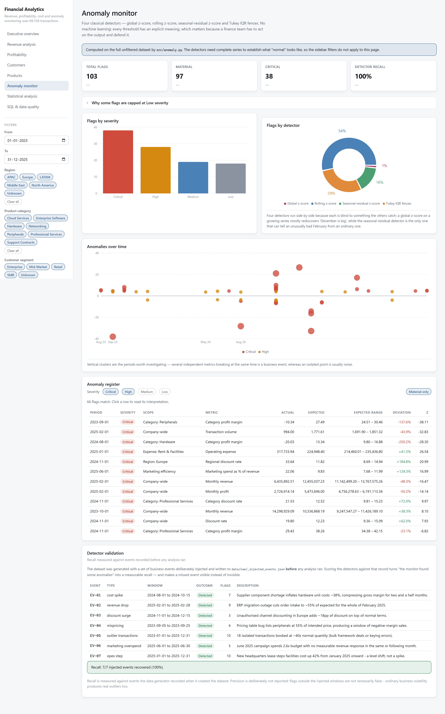

# Financial Performance & Profitability Analytics System

An end-to-end financial analytics platform: it takes messy transactional
extracts, cleans and reconciles them, loads a SQL warehouse, and answers the
questions a finance team actually asks — is revenue growing, why is margin
falling, which products and customers matter, and what looks wrong this month.

**No machine learning is used anywhere in this project.** Every finding rests on
SQL aggregation, classical statistics and time-series decomposition. That is the
point: the analysis is auditable, each number can be traced back to a query or a
named statistical test, and nothing is explained by "the model said so".

<p align="center">
  
</p>

---

## The headline finding

> **The business is growing fast and getting less profitable at the same time.**

| | 2025 | vs. prior year |
|---|---|---|
| Revenue | $186.8M | +25.4% |
| Cost of goods sold | $111.1M | +27.1% |
| Gross profit | $75.6M | +23.0% |
| Gross margin | 40.50% | −0.79 pp |
| Active customers | 1,040 | +7.8% |

Revenue compounds at **23.8% a year** (log-linear trend, p = 3.2e-06; Kendall's
τ = 0.54), but cost grows faster than revenue in every year of the period, so
gross margin falls from 42.9% to 40.5% — a loss of 2.4 percentage points worth
about **$4.5M of annual profit** at current scale. The two causes, isolated
separately, are cost inflation and deepening discounting that does not buy
proportionate volume.

The full narrative, with the supporting statistics, is in
**[reports/business_insights_report.md](reports/business_insights_report.md)**.

---

## Quick start

```bash
pip install -r requirements.txt
python run_pipeline.py          # builds everything from scratch (~2 minutes)
python -m src.api               # dashboard at http://127.0.0.1:8000
```

That is the whole setup. The pipeline is seeded (`SEED = 42`), so it reproduces
byte-for-byte, and the API serves the pre-built React frontend from
`frontend/dist` — **Node is only needed to rebuild the interface, not to use
it.** A machine with nothing but Python installed gets the complete dashboard.

Run a single stage, or reuse the existing raw data:

```bash
python run_pipeline.py --stage clean      # one stage only
python run_pipeline.py --skip-generate    # keep the existing raw extracts
```

---

## What it does, stage by stage

`run_pipeline.py` executes ten stages in dependency order. Each one writes an
artefact the next one reads, so any stage can be re-run on its own.

| Stage | Module | Produces |
|---|---|---|
| `generate` | `src/generate_data.py` | `data/raw/*.csv` — eight deliberately messy source extracts |
| `clean` | `src/clean_pipeline.py` | `data/processed/transactions_clean.csv` + rejects + audit log |
| `database` | `src/db_load.py` | `data/finance.db` — star schema, indexes, views |
| `sql` | `src/sql_analysis.py` | `reports/sql_results/*.csv` — 29 query outputs |
| `kpi` | `src/kpi.py` | `reports/kpi_summary.json` |
| `stats` | `src/stats_analysis.py` | `reports/statistical_analysis.json` |
| `timeseries` | `src/timeseries.py` | `reports/timeseries_analysis.json` |
| `anomaly` | `src/anomaly.py` | `reports/anomaly_report.json` |
| `figures` | `src/figures.py` | `reports/figures/*.png` — 10 static charts |
| `report` | `src/report.py` | `reports/business_insights_report.md` |

The written report is **generated from those artefacts, not typed by hand**, so
the report and the dashboard cannot drift apart.

---

## The data

Synthetic, but deliberately realistic: 71,946 raw transaction rows across three
years (2023–2025), plus operating expenses, marketing spend, employee costs,
monthly budgets, and accounts receivable.

The generator injects the defects a real extract has — duplicate rows, three
different date formats, currency symbols and thousands separators in numeric
columns, six spellings of each region, customer IDs written four ways, missing
values, impossible quantities and prices, and revenue figures that disagree with
their own components.

It also plants **seven business events** (a supplier cost shock, a discount
programme, a regional collapse, and so on) and records them in
`data/raw/_injected_events.json`. That file is ground truth: the anomaly monitor
is scored against it rather than against its own output, and currently recovers
**7 of 7 events (100% recall)**.

### What cleaning removes

| | Rows |
|---|---|
| Raw | 71,946 |
| Removed as duplicates | 1,754 |
| Quarantined as invalid | 1,036 |
| **Clean** | **69,156** (96.1% retained) |

Rejected rows are written to `transactions_rejected.csv` with a reason
column rather than deleted, so the exclusions are auditable. The top rejection
reasons are non-positive quantities (381), unparseable dates (209), and
discounts outside 0–1 (172).

**2,656 rows had a revenue figure that did not reconcile** with
`quantity × unit_price × (1 − discount)`. The pipeline treats the components as
truth and the reported figure as a claim to be measured, keeping the original in
`reported_revenue` and the discrepancy in `revenue_variance`.

---

## SQL is the analytical engine

The warehouse is a star schema — `fact_transactions` plus five supporting fact
tables, three dimensions, and four views. `sql/analysis_queries.sql` holds **29
analytical queries** written in portable ANSI SQL using CTEs and window
functions: monthly revenue trend, YoY growth, cohort retention, customer
concentration, discount impact, receivables ageing, budget variance, and more.

They live in a `.sql` file rather than in Python string literals, so they stay
readable, diffable, and runnable in any database client. The dashboard's SQL page
displays each query's source next to its result.

**Every dashboard endpoint answers by running SQL**, not by filtering a
DataFrame in Python — aggregation happens in the database, so the browser
receives tens of rows instead of tens of thousands.

### Running against PostgreSQL or MySQL instead

SQLite is the default so the project runs with zero server setup. The queries are
portable, so pointing at a server runs the same pipeline unchanged:

```bash
pip install psycopg2-binary
set FINANCE_DB_URL=postgresql+psycopg2://user:pw@localhost:5432/finance
python run_pipeline.py --stage database
```

---

## Statistical analysis

Seven hypothesis tests, each stated as a business question with an explicit null
and alternative, an effect size, an assumption check, and a robustness check
against a non-parametric alternative:

- Does deeper discounting significantly reduce profit margin?
- Is average order value different between North America and Europe?
- Do the regions differ in average order value at all? (one-way ANOVA)
- Has transaction-level margin declined between 2023 and 2025?
- Did hardware margin break in Aug–Oct 2024 relative to the same window in 2023?
- Are payment type and customer segment independent? (chi-square)
- Do weekend transactions differ in value from weekday ones?

**Effect sizes are reported alongside every p-value**, because with 69,156
transactions almost any difference reaches significance — the dashboard says so
directly on the Statistics page. Cohen's d, rank-biserial correlation, Cramér's
V and eta-squared are used as appropriate.

Confidence intervals use the t-distribution where it applies, a 10,000-iteration
percentile bootstrap where the distribution is skewed, and Wilson score intervals
for proportions (which stay inside [0, 1] near the boundary, where the normal
approximation does not).

A multiple regression of margin on discount, category, segment, region and order
size checks whether the discount effect survives controlling for confounders.

---

## Time-series and anomaly detection

Trend is fitted on **log revenue**, so the slope is a constant growth *rate* —
which is what "growing at x% a year" actually means — rather than a straight line
through the levels. Seasonality uses STL decomposition alongside a classical
centred moving average.

The anomaly monitor runs **four classical detectors**, each blind to what the
others catch:

| Detector | Catches |
|---|---|
| Global z-score | Points far from the series mean |
| Rolling z-score (6-month trailing) | Level breaks against recent history |
| Seasonal-residual z-score (STL, MAD scale) | An unusually bad February — one a global score would call normal |
| Tukey IQR fences (on the log scale) | Extreme individual transactions |

Every flag carries an expected range, the deviation, a severity, and a
plain-language interpretation.

**Statistical extremity is not business materiality.** A very stable series
(fixed rent) produces enormous z-scores for moves no finance team would act on,
so a flag must clear both the z threshold *and* a 5% relative-change floor before
it can rank above "Low". Immaterial flags are still reported — they are real —
but they cannot crowd out the findings that matter.

---

## The dashboard

Eight pages, served by FastAPI from a React + Recharts frontend. Filters (date
range, region, category, segment) apply across pages and push down into the SQL.

| | |
|---|---|
| [Executive overview](reports/screenshots/01_executive_overview.png) | [Revenue analysis](reports/screenshots/02_revenue_analysis.png) |
| [Profitability](reports/screenshots/03_profitability.png) | [Customers](reports/screenshots/04_customers.png) |
| [Products](reports/screenshots/05_products.png) | [Anomaly monitor](reports/screenshots/06_anomaly_monitor.png) |
| [Statistical analysis](reports/screenshots/07_statistical_analysis.png) | [SQL & data quality](reports/screenshots/08_sql_library.png) |

<p align="center">
  
  
</p>

Every chart carries a sentence saying what it shows — the dashboard is meant to
be read, not just looked at.

### Rebuilding the frontend

Only needed if you change the interface:

```bash
cd frontend
npm install
npm run build      # writes frontend/dist, which the API serves
npm run dev        # or the Vite dev server on :5173, with API CORS allowed
```

---

## Tests

```bash
python -m pytest
```

**177 tests** covering the parts where a silently wrong number would do the most
damage:

| Module | Covers |
|---|---|
| `test_cleaning.py` | Parsers on awkward input; validation rules; and invariants asserted over **every row** of the delivered table — the revenue, profit and margin identities, business-rule bounds, and standardised categoricals |
| `test_kpi.py` | Each KPI recomputed by hand on a four-row fixture, then the published `kpi_summary.json` re-checked against the transaction table |
| `test_statistics.py` | Estimators against closed-form answers — Cohen's d on data one SD apart, t-intervals against scipy, the bootstrap against the parametric interval, Wilson at the p = 0 boundary |
| `test_timeseries.py` | Series with known answers: a 1%/month compound series must return 1%/month; a planted December peak must be found; STL components must multiply back to the observed series |
| `test_anomaly.py` | Planted spikes each detector should find, plus the severity/materiality rules |
| `test_sql.py` | Every one of the 29 queries executed against the schema, with the SQL answers cross-checked against independent pandas computations |
| `test_api.py` | Every endpoint over the real HTTP stack; filter composition; and that the SQL-runner endpoint cannot be used to execute arbitrary SQL |

Tests that depend on pipeline artefacts skip with an instruction rather than
failing, so a fresh checkout gives a clean run before the pipeline has been
executed.

---

## Repository layout

```
data/
  raw/                     eight synthetic source extracts + injected-event ground truth
  processed/               cleaned transactions, rejects, cleaning audit log
  finance.db               SQLite warehouse (star schema, indexes, views)
sql/
  analysis_queries.sql     29 named analytical queries
  indexes_and_views.sql    schema objects created at load time
src/
  config.py                paths, database URL, analysis constants
  generate_data.py         synthetic source data with realistic defects
  clean_pipeline.py        cleaning, validation, reconciliation, derived metrics
  db_load.py               warehouse build
  sql_analysis.py          runs the query library, exports results
  kpi.py                   KPI framework with period comparisons
  stats_analysis.py        correlation, hypothesis tests, intervals, regression
  timeseries.py            trend, seasonality, decomposition, growth attribution
  anomaly.py               four classical detectors + ground-truth scoring
  figures.py               static matplotlib figures
  report.py                generates the business insights report
  api.py                   FastAPI backend, also serves the built frontend
frontend/                  React + Recharts dashboard (dist/ is pre-built)
notebooks/
  01_exploratory_data_analysis.ipynb    the exploratory pass, with outputs saved
reports/
  business_insights_report.md           the written analysis
  kpi_summary.json, statistical_analysis.json, timeseries_analysis.json,
  anomaly_report.json                   machine-readable analysis artefacts
  sql_results/                          29 query outputs as CSV
  figures/                              10 static charts
  screenshots/                          8 dashboard screenshots
tests/                     177 tests
tools/
  capture_screenshots.py   regenerates the dashboard screenshots
run_pipeline.py            the one command that builds everything
```

---

## Notebook

`notebooks/01_exploratory_data_analysis.ipynb` is the exploratory pass: revenue,
profitability, cost, customers, products, seasonality and anomalies, with the
reasoning written alongside each view rather than left implicit.

It **reads the pipeline's artefacts rather than recomputing them**, so it cannot
disagree with the dashboard or the report. Outputs are saved in the file, so it
reads without needing to be run.

---

## Technology

| | |
|---|---|
| Analysis | pandas, NumPy |
| Statistics | SciPy, statsmodels |
| Database | SQLAlchemy over SQLite (PostgreSQL/MySQL by environment variable) |
| Visualisation | matplotlib (static figures), Recharts (dashboard) |
| Backend | FastAPI, Uvicorn |
| Frontend | React 19, TypeScript, Vite |
| Tests | pytest |

Regenerating the dashboard screenshots additionally needs Playwright
(`pip install playwright && playwright install chromium`) — a tool for producing
the images, not a dependency of the project.

---

## Notes on the analysis

A few deliberate choices worth stating, since they change what the numbers mean:

- **KPI comparisons use trailing twelve months against the preceding twelve
  months**, not calendar year-to-date. Both windows then contain exactly one of
  every calendar month, so the comparison is immune to the seasonality that
  dominates this business.
- **Transaction-level Tukey fences are computed on the log scale.** Transaction
  values are lognormal; raw fences would classify a quarter of ordinary large
  orders as outliers.
- **551 transactions ($3.8M) could not be matched to a customer.** They stay in
  company revenue totals but are excluded from per-customer analysis, which is
  why customer revenue does not sum exactly to headline revenue. Attributing them
  by guesswork would have been the alternative, and a wrong attribution is worse
  than an acknowledged gap.
- **The data is synthetic.** The methods and the pipeline are the deliverable;
  the findings describe a simulated company, not a real one.

`reports/business_insights_report.md` section 13 states the analytical
limitations in full.
